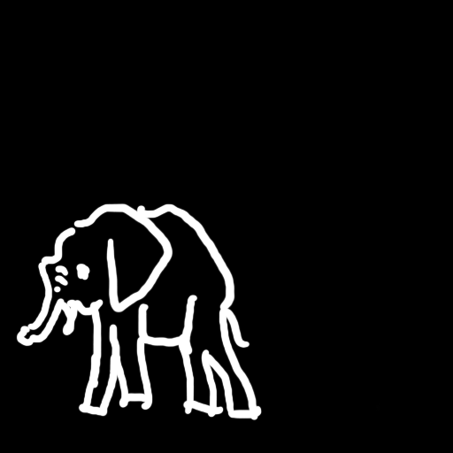
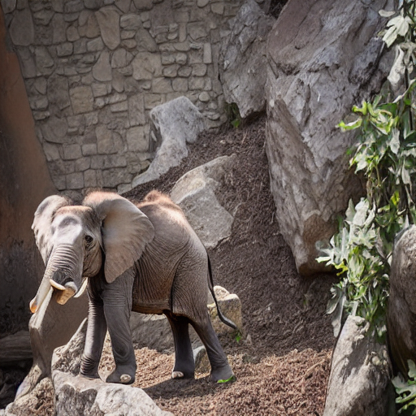
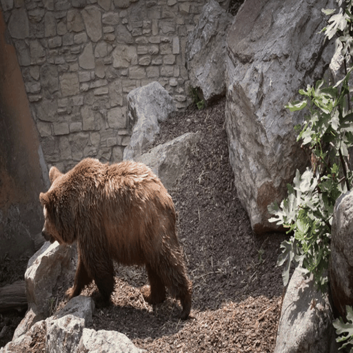
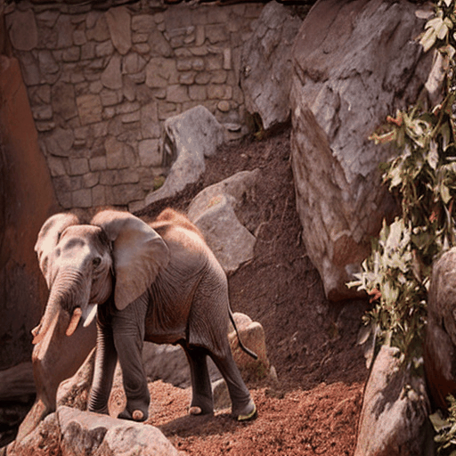
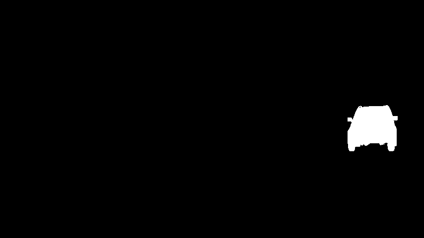
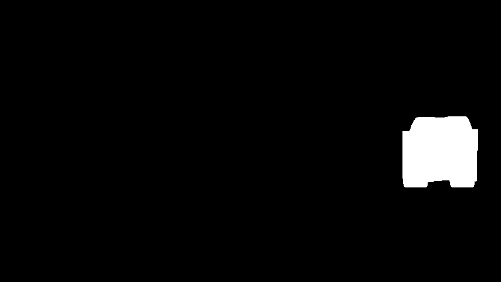
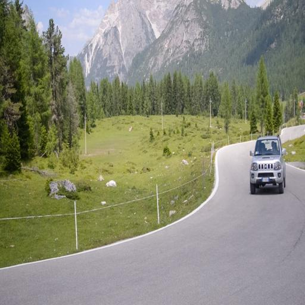
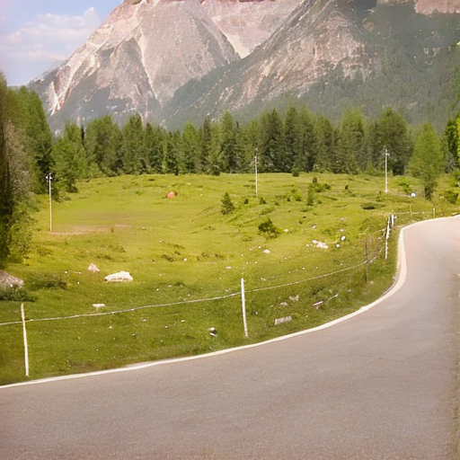
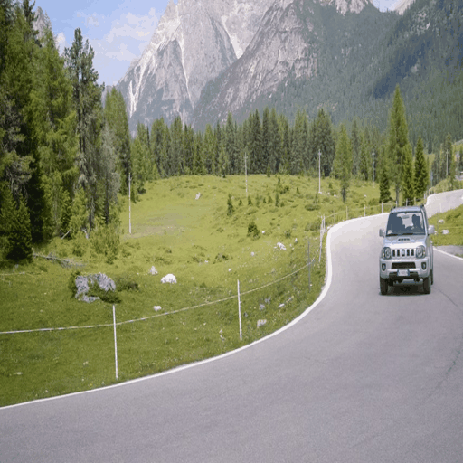
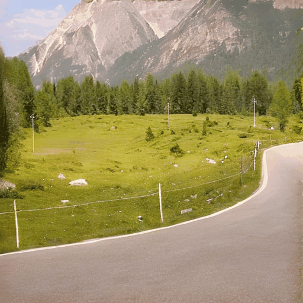

<div align="center">

# StableV2V: Stablizing Shape Consistency in Video-to-Video Editing

Chang Liu, Rui Li, Kaidong Zhang, Yunwei Lan, Dong Liu

[[`Paper`]](https://arxiv.org/abs/2411.11045) / [[`Project`]](https://alonzoleeeooo.github.io/StableV2V/) / [[`Huggingface`]](https://huggingface.co/AlonzoLeeeooo/StableV2V) / [[`Dataset`]](https://huggingface.co/datasets/AlonzoLeeeooo/DAVIS-Edit)
</div>

<!-- omit in toc -->
# Table of Contents
- [<u>1. News</u>](#news)
- [<u>2. To-Do Lists</u>](#to-do-lists)
- [<u>3. Overview of StableV2V</u>](#overview-of-stablev2v)
- [<u>4. Code Structure</u>](#code-structure)
- [<u>5. Prerequisites</u>](#prerequisites)
- [<u>6. Inference of StableV2V</u>](#inference-of-stablev2v)
- [<u>7. Training the Shape-guided Depth Refinement Network</u>](#training-of-the-shape-guided-depth-refinement-network)
- [<u>8. Citation</u>](#citation)
- [<u>9. Results</u>](#results)
- [<u>10. Star History</u>](#star-history)

If you have any questions about this work, please feel free to [start a new issue](https://github.com/AlonzoLeeeooo/StableV2V/issues/new) or [propose a PR](https://github.com/AlonzoLeeeooo/StableV2V/pulls).


<!-- omit in toc -->
# News
- [Nov. 19th] [Our arXiv paper](https://arxiv.org/abs/2411.11045) is currently released.
- [Nov. 18th] We updated the codebase of StableV2V.
- [Nov. 17th] We updated our [project page](https://alonzoleeeooo.github.io/StableV2V/).

<!-- omit in toc -->
# To-Do List
- [x] Update the codebase of `StableV2V`
- [ ] Upload all required model weights of `StableV2V` to our [HuggingFace repo](https://huggingface.co/AlonzoLeeeooo/StableV2V)
- [ ] Upload the curated testing benchmark `DAVIS-Edit` to our [HuggingFace repo](https://huggingface.co/datasets/AlonzoLeeeooo/DAVIS-Edit)
- [ ] Update a Gradio demo
- Regular Maintainence

[<u><small><🎯Back to Table of Contents></small></u>](#table-of-contents)


<!-- omit in toc -->
# Overview of StableV2V
StableV2V presents a novel paradigm to perform video editing in a shape-consistent manner, especially handling the editing scenarios when user prompts cause significant shape changes to the edited contents.
Besides, StableV2V shows superior flexibility in handling a wide series of down-stream applications, considering various user prompts from different modalities.

<div align="center">
  <video width="500" src="assets/github-teasor-comparison.mp4" autoplay loop muted></video>
  <video width="500" src="assets/github-teasor-applications.mp4" autoplay loop muted></video>
</div>


[<u><small><🎯Back to Table of Contents></small></u>](#table-of-contents)


<!-- omit in toc -->
# Code Structure
```
StableV2V
├── LICENSE
├── README.md
├── assets
├── datasets                       <----- Code of datasets for training of the depth refinement network
├── models                         <----- Code of model definitions in different components
├── runners                        <----- Code of engines to run different components
├── inference.py                   <----- Script to inference StableV2V
├── train_completion_net.py        <----- Script to train the shape-guided depth completion network
└── utils                          <----- Code of toolkit functions
```

[<u><small><🎯Back to Table of Contents></small></u>](#table-of-contents)


<!-- omit in toc -->
# Prerequisites
<!-- omit in toc -->
## 1. Install the Dependencies
We offer an one-click command line to install all the dependencies that the code requires.
Specifically, you can execute:
```bash
pip install -r requirements.txt
```

<!-- omit in toc -->
## 2. Pre-trained Model Weights
Before you start the inference process, you need to prepare the model weights that `StableV2V` requires.

<details>  <summary> Currently, we are uploading the pre-trained model weights to our [HuggingFace repo](https://huggingface.co/AlonzoLeeeooo/StableV2V), so that users can get access to all weights in the same repo.
Before that, you may refer to the official links in the following table. </summary>

|Model|Component|Link|
|-|-|-|
|Paint-by-Example|PFE|[`Fantasy-Studio/Paint-by-Example`](https://huggingface.co/Fantasy-Studio/Paint-by-Example)|
|InstructPix2Pix|PFE|[`timbrooks/instruct-pix2pix`](https://huggingface.co/timbrooks/instruct-pix2pix)|
|SD Inpaint|PFE|[`botp/stable-diffusion-v1-5-inpainting`](https://huggingface.co/botp/stable-diffusion-v1-5-inpainting)|
|ControlNet + SD Inpaint|PFE|ControlNet models at [`lllyasviel`](https://huggingface.co/lllyasviel)|
|AnyDoor|PFE|[`xichenhku/AnyDoor`](https://huggingface.co/spaces/xichenhku/AnyDoor/tree/main)|
|RAFT|ISA|[`Google Drive`](https://drive.google.com/drive/folders/1sWDsfuZ3Up38EUQt7-JDTT1HcGHuJgvT)|
|MiDaS|ISA|[`Link`](https://github.com/isl-org/MiDaS/releases/download/v3_1/dpt_swin2_large_384.pt)|
|U2-Net|ISA|[`Link`](https://huggingface.co/AlonzoLeeeooo/LaCon/resolve/main/data-preprocessing/u2net.pth)|
|Depth Refinement Network|ISA|[`Link`](https://huggingface.co/AlonzoLeeeooo/StableV2V/resolve/main/50000.ckpt)|
|SD v1.5|CIG|[`stable-diffusion-v1-5/stable-diffusion-v1-5`](https://huggingface.co/stable-diffusion-v1-5/stable-diffusion-v1-5/)|
|ControlNet (depth)|CIG|[`lllyasviel/control_v11f1p_sd15_depth`](https://huggingface.co/lllyasviel/control_v11f1p_sd15_depth)|
|Ctrl-Adapter|CIG|[`hanlincs/Ctrl-Adapter`](https://huggingface.co/hanlincs/Ctrl-Adapter) (`i2vgenxl_depth`)|
|I2VGen-XL|CIG|[`ali-vilab/i2vgen-xl`](https://huggingface.co/ali-vilab/i2vgen-xl)|

</details>

Once you downloaded all the model weights, put them in the `checkpoints` folder.

> [!NOTE]
> If your network environment can get access to HuggingFace, you can directly use the HuggingFace repo ID to download the models.
> Otherwise we highly recommend you to prepare the model weights locally.

Specfically, make sure you modify the configuration file of `AnyDoor` at `models/anydoor/configs/anydoor.yaml` with the path of DINO-v2 pre-trained weights:
```
(at line 83)
cond_stage_config:
  target: models.anydoor.ldm.modules.encoders.modules.FrozenDinoV2Encoder
  weight: /path/to/dinov2_vitg14_pretrain.pth
```


[<u><small><🎯Back to Table of Contents></small></u>](#table-of-contents)


<!-- omit in toc -->
# Inference of StableV2V

You may refer to the following command line to run `StableV2V`:
```bash
python inference.py --raft-checkpoint-path checkpoints/raft-things.pth --midas-checkpoint-path checkpoints/dpt_swin2_large_384.pt --u2net-checkpoint-path checkpoints/u2net.pth  --stable-diffusion-checkpoint-path stable-diffusion-v1-5/stable-diffusion-v1-5 --controlnet-checkpoint-path lllyasviel/control_v11f1p_sd15_depth --i2vgenxl-checkpoint-path ali-vilab/i2vgen-xl --ctrl-adapter-checkpoint-path hanlincs/Ctrl-Adapter --completion-net-checkpoint-path checkpoints/depth-refinement/50000.ckpt --image-editor-type paint-by-example --image-editor-checkpoint-path /path/to/image/editor --source-video-frames examples/frames/bear --external-guidance examples/reference-images/raccoon.jpg --prompt "a raccoon" --outdir results
```


<details><summary> For detailed illustrations of the arguments, please refer to the table below. </summary>

|Argument|Default Setting|Required or Not|Explanation|
|-|-|-|-|
|Model arguments|-|-|-|
|`--image-editor-type`|-|Yes|Argument to define the image editor type.|
|`--image-editor-checkpoint-path`|-|Yes|Path of model weights for the image editor, required by PFE.|
|`--raft-checkpoint-path`|`checkpoints/raft-things.pth`|Yes|Path of model weights for RAFT, required by ISA.|
|`--midas-checkpoint-path`|`checkpoints/dpt_swin2_large_382.pt`|Yes|Path of model weights for MiDaS, required by ISA.|
|`--u2net-checkpoint-path`|`checkpoints/u2net.pth`|Yes|Path of model weights for U2-Net, required by ISA to obtain the segmentation masks of video frames (will be replaced by SAM in near future)|
|`--stable-diffusion-checkpoint-path`|`stable-diffusion-v1-5/stable-diffusion-v1-5`|Yes|Path of model weights for SD v1.5, required by CIG.|
|`--controlnet-checkpoint-path`|`lllyasviel/control_v11f1p_sd15_depth`|Yes|Path of model weights for ControlNet (depth) required by CIG.|
|`--ctrl-adapter-checkpoint-path`|`hanlincs/Ctrl-Adapter`|Yes|Path of model weights for Ctrl-Adapter, required by CIG.|
|`--i2vgenxl-checkpoint-path`|`ali-vilab/i2vgen-xl`|Yes|Path of model weights for I2VGen-XL, required by CIG.|
|`--completion-checkpoint-path`|`checkpoints/depth-refinement/50000.ckpt`|Yes|Path of model weights for I2VGen-XL, required by CIG.|
|Input Arguments|-|-|-|
|`--source-video-frames`|-|Yes|Path of input video frames.|
|`--prompt`|-|Yes|Text prompt of the edited video.|
|`--external-guidance`|-|Yes|External inputs for the image editors if you use `Paint-by-Example`, `InstructPix2Pix`, and `AnyDoor`.|
|`--outdir`|`results`|Yes|Path of output directory.|
|`--edited-first-frame`|-|No|Path of customized first edited frame, where the image editor will not be used if this argument is configured.|
|`--input-condition`|-|No|Path of cusromzied depth maps. We directly extract depth maps from the source video frames with `MiDaS` if this argument is not configured|
|`--input-condition`|-|No|Path of cusromzied depth maps. We directly extract depth maps from the source video frames with `MiDaS` if this argument is not configured.|
|`--reference-masks`|-|No|Path of segmentation masks of the reference image, required by `AnyDoor`. We will automatically extract segmentation mask from the reference image if this argument is not configured.|
|`--image-guidance-scale`|1.0|No|Hyper-parameter required by InstructPix2Pix.|
|`--kernel-size`|9|No|Kernel size of the binary dilation operation, to make sure that the pasting processes cover the regions of edited contents.|
|`--dilation-iteration`|1|No|Iteration for binary dilation operation.|
|`--guidance-scale`|9.0|No|Classifier-free guidance scale.|
|`--mixed-precision`|bf16|No|Precision of models in StableV2V.|
|`--n-sample-frames`|16|No|Number of video frames of the edited video.|
|`--seed`|42|No|Random seed.|
</details>

> [!NOTE]
> Some specific points that you may pay additional attentions to while inferencing:
>
> 1. By configuring `--image-editor-checkpoint-path`, the path will be automatically delievered to the corresponding editor according to your `--image-editor-type`. So please do not be worried about some extra arguments in the codebase.
> 2. If you are using `Paint-by-Example`, `InstructPix2Pix`, `AnyDoor`, you are required to configure the `--external-guidance` argument, which corresponds to reference image and user instruction accordingly.
> 3. Our method does not currently support `xformers`, which might cause artifacts in the produced results. Such issue might be fixed in the future if possible.

## Performing Sketch-based Editing with `StableV2V`
<details> <summary> So far, we have not found an efficient way to perform the sketch-based editing within one command line, thus we showcase our way in doing so for reference, where the procedures are shown below. </summary>


### 1. Prepare the Hand-drawn Sketches through External Devices
To obtain the human-drawn sketches, you need to manually draw them on external devices such as a tablet, and then export the result for later uses.
Particularly, we obtain the hand-drawn sketches on the iPad application `Sketchbook`. An example hand-drawn sketch might look like this:

<div align="center">
  
  
</div>

### 2. Use `ControlNet (scribble)` to Generate the First Edited Frame
Once you obtain the hand-drawn sketch, the next step is to get the first edited frame.
In doing so, we use `ControlNet (scribble)`, where you need to prepare the model weights of [`ControlNet (scribble)`](https://huggingface.co/lllyasviel/control_v11p_sd15_scribble) and [`SD Inpaint`](https://huggingface.co/botp/stable-diffusion-v1-5-inpainting) in advance.
Suppose we put the previously hand-drawn sketches at `inputs/hand-drawn-sketches`, you can execute the following command line by running `ControlNet (scribble)`:
```bash
python scripts/inference_controlnet_inpaint.py --controlnet-checkpoint-path lllyasviel/control_v11p_sd15_scribble --stable-diffusion-checkpoint-path botp/stable-diffusion-v1-5-inpainting --prompt "an elephant" --input-mask inputs/masks/bear.png --controlnet-guidance inputs/hand-drawn-sketches/bear-elephant-sketch.png --outdir results/sketch-guided-result.png
```
The result might seem like:
<div align="center">
  
</div>


### 3. Use the First Edited Frame to Generate the Edited Video
Finally, you are ready to generate the entire edited video. We offer an example command line as follows:
```bash
python inference.py --raft-checkpoint-path checkpoints/raft-things.pth --midas-checkpoint-path checkpoints/dpt_swin2_large_384.pt --u2net-checkpoint-path checkpoints/u2net.pth  --stable-diffusion-checkpoint-path stable-diffusion-v1-5/stable-diffusion-v1-5 --controlnet-checkpoint-path lllyasviel/control_v11f1p_sd15_depth --i2vgenxl-checkpoint-path ali-vilab/i2vgen-xl --ctrl-adapter-checkpoint-path hanlincs/Ctrl-Adapter --completion-net-checkpoint-path checkpoints/depth-refinement/50000.ckpt --source-video-frames examples/frames/bear --edited-first-frame inputs/edited-first-frames/bear-elephant.png --prompt "an elephant walking on the rocks in a zoo" --outdir results 
```
By configuring the `--edited-first-frame`, the codebase will automatically skip the first-frame editing process, where we visualize the source video and the edited video below:

<div align="center">
  
  
</div>

</details>

[<u><small><🎯Back to Table of Contents></small></u>](#table-of-contents)


## Performing Video Inpainting with `StableV2V`
<details> <summary> The application of video inpainting has similar problem to that of sketch-based editing, we have not found integrated solution so far. Thus, we showcase how we perform such application in the following contents for potential reference. </summary>

### 1. (Optional) Dilate the Input Mask
Before you inpaint the first video frame, we recommend you dilate the annotated segmentation mask (if any) using the following script:
```
python scripts/run_dilate_mask.py --input-folder inputs/masks/car-turn.png --output-folder inputs/dilated-masks --kernel-size 15 --iterations 1
```
The original (left) and dilated (right) masks might look like:
<div align="center">
  
  
</div>

### 2. Use `IOPaint` to Generated the First Inpainted Frame
We recommend you to use the library `IOPaint` for convenient use. To install it, you can simply run:
```bash
pip install iopaint
```
Then, you are able to execute `LaMa` through the library:
```
iopaint run --model=lama --image inputs/frames/car-turn/00000.jpg --mask inputs/dilated-masks/car-turn.png --output inputs/edited-first-frames/
```
The original and inpainted first frames might look like:


<div align="center">
  
  
</div>


### 3. Use the First Edited Frame to Generate the Edited Video
Finally, you are ready to generate the entire edited video. We offer an example command line as follows:
```bash
python inference.py --raft-checkpoint-path checkpoints/raft-things.pth --midas-checkpoint-path checkpoints/dpt_swin2_large_384.pt --u2net-checkpoint-path checkpoints/u2net.pth  --stable-diffusion-checkpoint-path stable-diffusion-v1-5/stable-diffusion-v1-5 --controlnet-checkpoint-path lllyasviel/control_v11f1p_sd15_depth --i2vgenxl-checkpoint-path ali-vilab/i2vgen-xl --ctrl-adapter-checkpoint-path hanlincs/Ctrl-Adapter --completion-net-checkpoint-path checkpoints/depth-refinement/50000.ckpt --source-video-frames examples/frames/car-turn --edited-first-frame inputs/edited-first-frame/car-turn-inpainted.png --prompt "an elephant walking on the rocks in a zoo" --outdir results 
```
By configuring the `--edited-first-frame`, the codebase will automatically skip the first-frame editing process, where we visualize the source video and the edited video below:

<div align="center">
  
  
</div>

</details>

[<u><small><🎯Back to Table of Contents></small></u>](#table-of-contents)


<!-- omit in toc -->
# Training of the Shape-guided Depth Refinement Network
## 1. Download the `YouTube-VOS` Dataset
We use `YouTube-VOS` to conduct the training process of our shape-guided depth refinement network.
Before you start the training process, you need to first download its source videos and annotations from [this link](https://codalab.lisn.upsaclay.fr/competitions/6066#participate-get_data).
Once downloaded, the data follows the structures below:
```
youtube-vos
├── JPEGImages                     <----- Path of source video frames
├── Annotations                    <----- Path of segmentation masks
└── meta.json                      <----- Annotation file for the segmentation masks
```

## 2. Use `MiDaS` to Annotate the Depth Maps
Once the video frames are ready, the next step is to annotate their corresponding depth maps.
Specifically, make sure you download the `MiDaS` model weights from [this link](https://github.com/isl-org/MiDaS/releases/download/v3_1/dpt_swin2_large_384.pt).
Then, you can execute the following command lines with our automatic script:
```bash
python scripts/extract_youtube_vos_depths.py --midas-path checkpoints/dpt_swin2_large_384.pt --dataset-path data/youtube-vos/JPEGImages --outdir data/youtube-vos/DepthMaps
```

## 3. Use `U2-Net` to Annotate the First-frame Shape Masks
Our depth refinement network uses an additional network channel to take the first-frame shape mask as guidance, thus you need to annotate them for the `YouTube-VOS` dataset.
First, make sure you download the `U2-Net` model weights from [this link](https://huggingface.co/AlonzoLeeeooo/LaCon/resolve/main/data-preprocessing/u2net.pth).
Then, you execute the following command lines with our automatic script:
```bash
python scripts/extract_youtube_vos_shapes.py --video-root data/youtube-vos/JPEGImages --model-dir checkpoints/u2net.pth --outdir data/youtube-vos/FirstFrameMasks
```


## 4. Train the Model
Finally, you are ready to execute the training process with the following command line:
```bash
python train_completion_net.py --video-path data/youtube-vos/JPEGImages --shape-path data/youtube-vos/FirstFrameMasks --max-train-steps 50000 --outdir results/shape-guided-depth-refinement --checkpoint-freq 2000 --validation-freq 200
```

The trained model weights will be saved at `results/checkpoints`, and the visualizations of intermediate results can be checked via `tensorboard`, with the logs saved at `results/tensorboard`.


[<u><small><🎯Back to Table of Contents></small></u>](#table-of-contents)


<!-- omit in toc -->
# Results
Please refer to our [project page](https://alonzoleeeooo.github.io/StableV2V/) for more results and comparisons performed by `StableV2V`.

[<u><small><🎯Back to Table of Contents></small></u>](#table-of-contents)


<!-- omit in toc -->
# Citation
If you find this work helpful to your research, or use our testing benchmark `DAVIS-Edit`, please cite our paper:
```
@misc{liu-etal-2024-stablev2v,
      title={StableV2V: Stablizing Shape Consistency in Video-to-Video Editing}, 
      author={Chang Liu and Rui Li and Kaidong Zhang and Yunwei Lan and Dong Liu},
      year={2024},
      eprint={2411.11045},
      archivePrefix={arXiv},
      primaryClass={cs.CV},
}
```


[<u><small><🎯Back to Table of Contents></small></u>](#table-of-contents)


<!-- omit in toc -->
# Star History

<p align="center">
    <a href="hhttps://api.star-history.com/svg?repos=alonzoleeeooo/StableV2V&type=Date" target="_blank">
        
    </a>
</p>

[<u><small><🎯Back to Table of Contents></small></u>](#table-of-contents)
